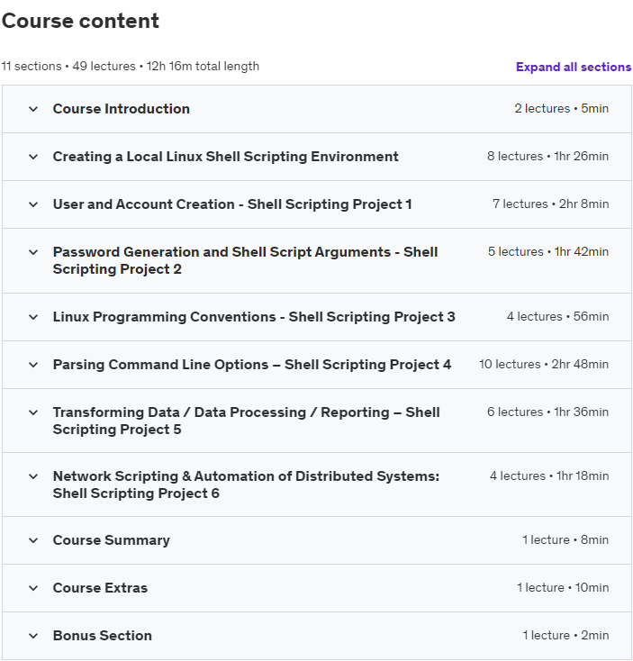

# Linux Shell Scripting: A Project-Based Approach to Learning

<h4>Learn how to shell script through project-based training (Bash Scripting, Bash Programming, Sed, Grep, Awk, and More)</h4>

<a href='https://www.udemy.com/course/linux-shell-scripting-projects/'>Course's link</a>

