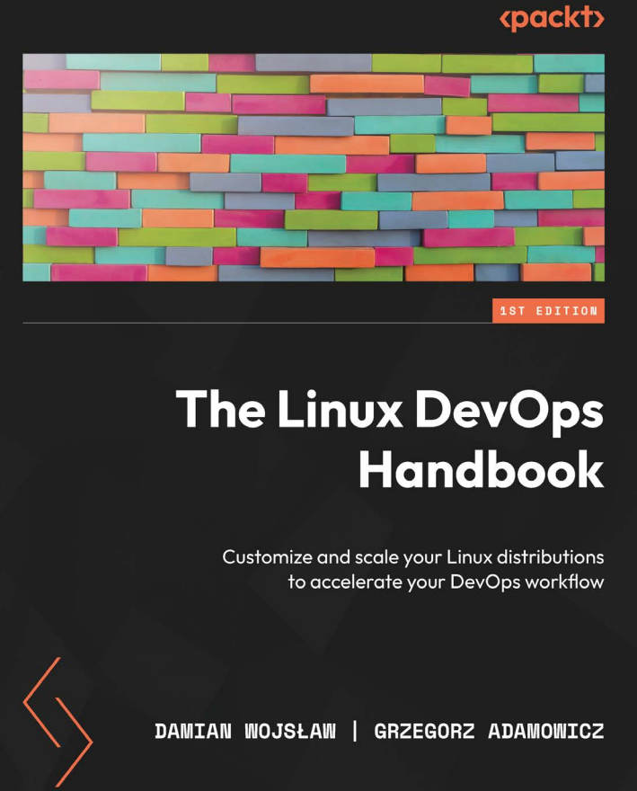

# The Linux DevOps Handbook

### Customize and scale your Linux distributions to accelerate your DevOps workflow

<ul>
    <li><b>Part 1: Linux Basics</b></li>
    <ul>
        <li>Chapter 1: Choosing the Right Linux Distribution</li>
        <li>Chapter 2: Command-Line Basics</li>
        <li>Chapter 3: Intermediate Linux</li>
        <li>Chapter 4: Automating with Shell Scripts</li>
    </ul>
    <li><b>Part 2: Your Day-to-Day DevOps Tools</b></li>
    <ul>
        <li>Chapter 5: Managing Services in Linux</li>
        <li>Chapter 6: Networking in Linux</li>
        <li>Chapter 7: Git, Your Doorway to DevOps</li>
        <li>Chapter 8: Docker Basics</li>
        <li>Chapter 9: A Deep Dive into Docker</li>
    </ul>
    <li><b>Part 3: DevOps Cloud Toolkit</b></li>
    <ul>
        <li>Chapter 10: Monitoring, Tracing, and Distributed Logging</li>
        <li>Chapter 11: Using Ansible for Configuration as Code</li>
        <li>Chapter 12: Leveraging Infrastructure as Code</li>
        <li>Chapter 13: CI/CD with Terraform, GitHub, and Atlantis</li>
        <li>Chapter 14: Avoiding Pitfalls in DevOps</li>
    </ul>